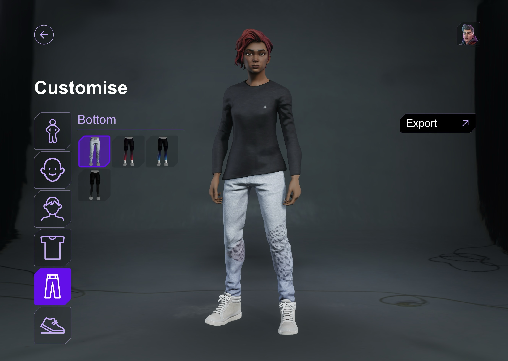

# Avatar Creator

This repo contains:

- [`packages/avatar-creator`](packages/avatar-creator) – a React component library that lets users
  build fully-rigged 3D avatars powered by the [PlayCanvas](https://playcanvas.com) engine.
- [`examples/avatar-preview-app`](examples/avatar-preview-app) – a minimal Next.js application that
  embeds the Avatar Creator and serves as a live playground / reference integration.



## TODO:

- [ ] Make UI more composable as part of a wider application (e.g. not assuming fullscreen)
- [ ] Add API for loading and saving avatar configurations
- [ ] Update data model to allow more flexibility for custom part combinations

---

## Getting Started

1. **Install dependencies (workspace-wide)**

   ```bash
   nvm use # otherwise use Node.js v22.x
   npm install
   ```

2. **Set up Git LFS for large assets**

   This project uses Git LFS to manage large 3D model files (.glb) and image assets (.webp). Make
   sure you have Git LFS installed and set up:

   ```bash
   # Install Git LFS (if not already installed)
   # On macOS with Homebrew:
   brew install git-lfs

   # On other systems, see: https://git-lfs.github.io/

   # Initialize Git LFS in the repository
   git lfs install

   # Pull the large files
   git lfs pull
   ```

3. **Start the development servers**

   ```bash
   npm run iterate # or `npm run dev`
   ```

   This will:

   - build `packages/avatar-creator` in watch-mode
   - launch the Next.js preview app on <http://localhost:3000>

   Open http://localhost:3000 in your browser – you should see the Avatar Creator embedded in the
   preview site.

> 💡 Prefer to run packages individually?
>
> ```bash
> # in one terminal – build the library and serve static assets
> cd packages/avatar-creator && npm run iterate
>
> # in another terminal – start the preview app
> cd examples/avatar-preview-app && npm run iterate
> ```

---

## Production Builds

```bash
# build everything
npm run build

# preview the Next.js production build
cd examples/avatar-preview-app && npm run start
```

The library is compiled to ESM bundles (and type declarations) under
`packages/avatar-creator/build/`.

For more information on how to release new versions see the [release docs](./docs/RELEASE.md).

---

## Data Structure

See [examples/avatar-preview-app/public/data.json](examples/avatar-preview-app/public/data.json)

This specific project implements a static JSON data containing multiple body types, skin colors and
various slot models: `body`, `head`, `hair`, `top`, `bottom`, `shoes`. As well as list of
animations.

All files must be paired: `.glb` for 3D models and `.webp` for thumbnails, sharing the same filename
(excluding the extension).

You can modify the [.env.example](.env.example) file to point to a different file or API endpoint
for custom data. Ensure the JSON format matches when using an API endpoint.

### Body Parts & Slot Models:

**Body** - is a custom slot, that is skin dependant. And will be loaded automatically based on other
slots.

All URLs in data are defined as an absolute URL, but without an extension, as it will be added by
the app: `.glb` (for 3D rendering) and `.webp` (for thumbnail).

**Skin** - There are 7 skin colors, with some slots being "skin-dependent." These slots require 7
pairs of assets to support all skin colors. For such skin-dependent slots, define a single URL per
model in the data, and the app will append \_01 to \_07 based on the selected skin index.

### Slots:

- **Body** - is a custom slot, that is skin dependant. And will be loaded automatically based on
  other slots.

- **Head** - is a skin dependant slot.

- **Hair** - is a simple slot.

- **Top** - can have `secondary` property, which will add an additional GLB for that slot.
  AvatarLoader will load it as `top:secondary`. If slot has `torso:true`, then torso will be when
  this slot is loaded - this is common for shirts, while e.g. Hoodie covers whole torso so by
  default it will not be rendering torso.

- **Bottom** - can have `secondary` the same way as `top` slot, and optional property `legs:true`,
  if set to true, then legs will be rendered also. This is common for shorts for example. By default
  legs will not be rendered.

- **Shoes** - is a simple slot.

## Hosting Assets

This project includes model and thumbnail assets for testing. In production, host these on a
high-availability, high-throughput CDN to avoid bottlenecks. Make sure URLs in data file are
pointing to your assets.

Configure CDN files with aggressive caching to minimize network requests and speed up downloads.

### Animations (optional):

You can specify a list of animations, including a default "idle" animation and an optional "appear"
animation that plays once when the avatar first loads.

Animations can include an "emote" property, allowing users to select and play specific animations
from the UI.

---

## How to make new assets

For production of assets, there a few recommendations and guidelines as well as templates to follow:

- [Clothes](./docs/clothes.md)
- _TODO_ - Faces
- _TODO_ - Hair

---

## License

The contents of this repository is MIT Licensed.

Any referenced avatar assets not otherwise explicitly licensed are property of their respective
owners. All rights reserved.
